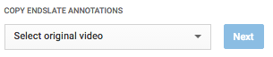
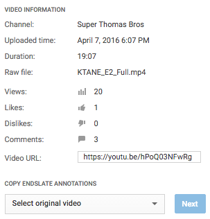

# EndSlateCopier
Do you use Google Chrome and run a YouTube Series? Do many of your videos include end slate annotations that are a pain to copy from one video to another? Then this extension may help!

---

**EndSlateCopier** is a Chrome extension which serves to simplify the process of copying end slate annotations to other YouTube videos on your channel.

It adds the following component to YouTube's video editor page:

---

# Installation

1. Either clone this repository, or simply download the codebase as a zip archive.

2. Visit the Google Chrome extension manager by entering the following URL into Chrome: `chrome://extensions`

3. Ensure Developer mode is enabled at the top of this screen.

4. Click the **Load unpacked extension** button and select the `EndSlateCopier_extension` directory in this repository.

5. Verify that the extension has been added to your browser by finding it in the list: 

---

# Usage

Simply enter the edit page for any of your YouTube videos, and the extension will appear below the video info, like so:

Simply follow the instructions intuitively to copy the end slate annotations from the selected video to the video you are currently editing.

---

# Caveats

This extension "detects" end slate annotations of a video by analyzing all annotations and copying only the annotations that end within five seconds of the end of the video.

For example, if you have an annotation towards the beginning of the video, it will not be copied, but all annotations near the end of the video will be copied and placed at the very end of the video being edited.

This tool is meant for quick annotation copying and pasting, essentially. If more careful changes are required between videos, such as positioning and sizing of the annotations, you will need to make those changes manually.

---

# Libraries

This extension is dependent on the jQuery project (c) 2005, 2015 jQuery Foundation, Inc: [http://jquery.org/license](http://jquery.org/license)

---

# License

**EndSlateCopier** is licensed under the MIT License:

The MIT License (MIT)
Copyright (c) 2016 William Thomas

Permission is hereby granted, free of charge, to any person obtaining a copy of this software and associated documentation files (the "Software"), to deal in the Software without restriction, including without limitation the rights to use, copy, modify, merge, publish, distribute, sublicense, and/or sell copies of the Software, and to permit persons to whom the Software is furnished to do so, subject to the following conditions:

The above copyright notice and this permission notice shall be included in all copies or substantial portions of the Software.

THE SOFTWARE IS PROVIDED "AS IS", WITHOUT WARRANTY OF ANY KIND, EXPRESS OR IMPLIED, INCLUDING BUT NOT LIMITED TO THE WARRANTIES OF MERCHANTABILITY, FITNESS FOR A PARTICULAR PURPOSE AND NONINFRINGEMENT. IN NO EVENT SHALL THE AUTHORS OR COPYRIGHT HOLDERS BE LIABLE FOR ANY CLAIM, DAMAGES OR OTHER LIABILITY, WHETHER IN AN ACTION OF CONTRACT, TORT OR OTHERWISE, ARISING FROM, OUT OF OR IN CONNECTION WITH THE SOFTWARE OR THE USE OR OTHER DEALINGS IN THE SOFTWARE.
